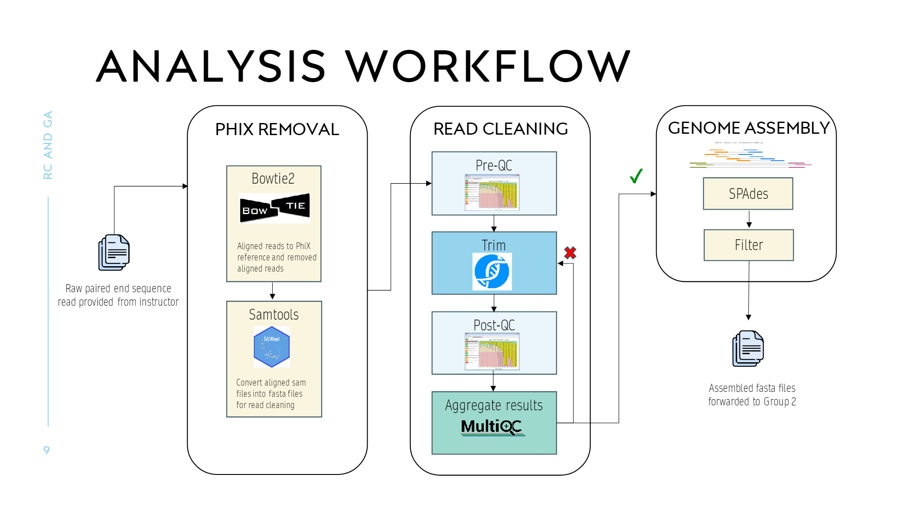
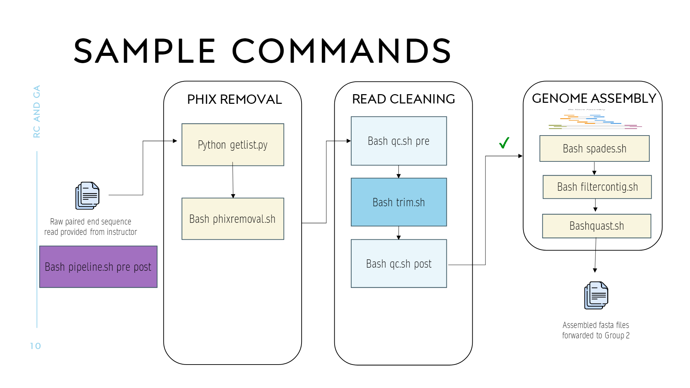
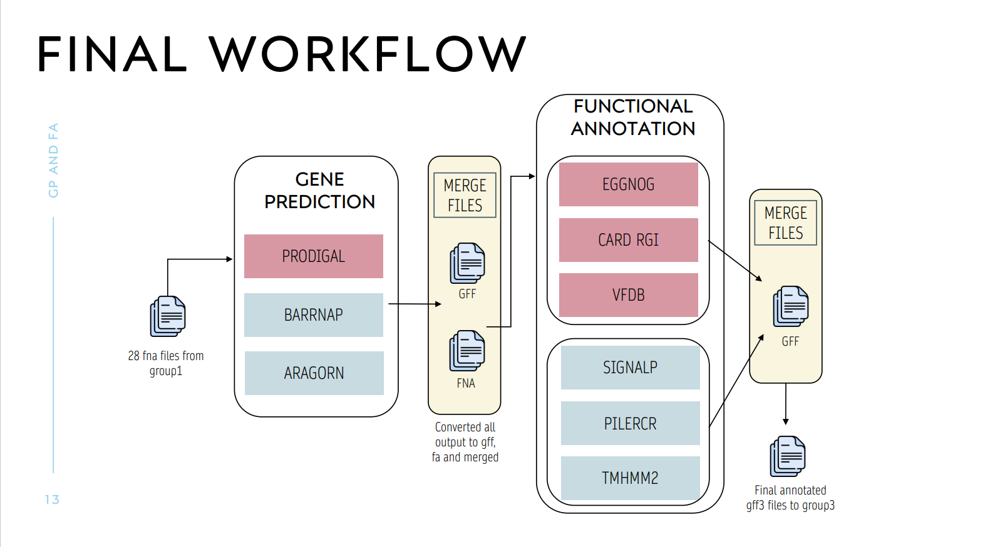

# Bacterial Genome Assembler, Predictor and Annotator 

There are two pipelines available here. One for Genome assembly from raw fastq files. And the other for genome annotation from assembled files.

## ASSEMBLY PIPELINE
This pipeline is designed to take Illumina paired-end reads as input and produce contiguous genome assemblies for the same along with assembly quality metrics. As for intermediate steps, the pipeline performs trimming and quality filtering to improve the quality of reads used by downstream genome assemblers. It uses SPAdes assembler to assemble.

The pipeline takes two required arguments: (i) an input reads directory and (ii) an output directory for storing final assembly files. As for other arguments, the user can choose verbose mode.




## ANNOTATION PIPELINE
This pipeline is designed for genome prediction and annotation of assembled Illumina paired-end reads. There It caters to several gene prediction and gene annotation tools based on your requirements. 

The pipeline takes two required arguments: (i) an input reads directory and (ii) an output directory for storing final assembly files. As for other arguments, the user can choose gene prediction tools from [prodigal/metageneannotator/glimmer] (defaults to Prodigal) and if they want verbose mode.



## Installation
This pipeline is a bash script that uses a Conda/Mamba environment with the appropriate packages and dependecies. We recommend using Mamba over Conda due to its overall better performance in package installation and dependency resolution. You can find the Mamba installation guide here - Mamba Docs.

Next, we recommend you to clone this repository into your local system using either the https option or ssh. For reference, here is how to do it using the https option.

>git clone https://github.com/Palak-Chaudhry/Bacterial-Genome-Assembler-and-Annotator.git

Now, that you have this repo cloned and available as a directory in your system, go ahead and create and activate a mamba environment from the yml files provided in the setup directory.

```  
mamba env create environments/geneannotate.yml -n your_env_name
mamba activate your_env_name
```
## Usage
### Preparing your data

Your paired-end reads, i.e. forward and reverse reads for all your genomes should be in a single input folder. Additionally, every read pair should be named as follows - {sample_name}_R1.fastq.gz and {sample_name}_R2.fastq.gz.

See example_input/ as a reference below.

example_input/

     SRR20966265_R1.fastq.gz
     
     SRR20966265_R2.fastq.gz

### Running the script

In order to see the usage of the script and all required and optional arguments, you can print the help message by typing the following inside the main repo directory

./assembly_pipeline.sh -h

```
Usage: bash assembly_pipeline.sh -i <input directory> -o <output directory> -[OPTIONS]
            Bacterial gene assembly for Illumina short-reads. The options available are:
                     -i : Input Directory for genome assembly (directory containing raw reads in fastq.gz format)[required]
                     -o : Output directory for all results [required]
                     -v : Flag to turn on verbose mode
                     -h : Print usage instructions
```

./annotation_pipeline.sh -h

```
Usage: bash annotation_pipeline.sh -i <input directory> -o <output directory> -[OPTIONS]
            Bacterial Gene Prediction for Illumina short-reads. The options available are:
                    -i : Input Directory for genome prediction (directory containing assembled fna)[required]
                    -o : Output directory for all results [required]
                    -t : Tool to choose from [prodigal/metageneannotator/glimmer] (defaults to Prodigal)
                    -v : Flag to turn on verbose mode
                    -h : Print usage instructions
```
### Miscellaneous

The misc/ folder contains scripts for evaluation of different gene prediction tools using homology based method. Here you can extract the 16S rRNA sequences from your genomes (fasta files present in the outputdir/barrnap forlder). Run these 16S rRNA sequences against BLAST to find your reference bacterial strain. 
Use the misc/evaluation.sh script to calculate the sensitivity, recall and other evaluation metrics as needed to compare!

### NOTE
for further questions, you can mail me at pchaudhry7@gatech.edu

CHEERS!